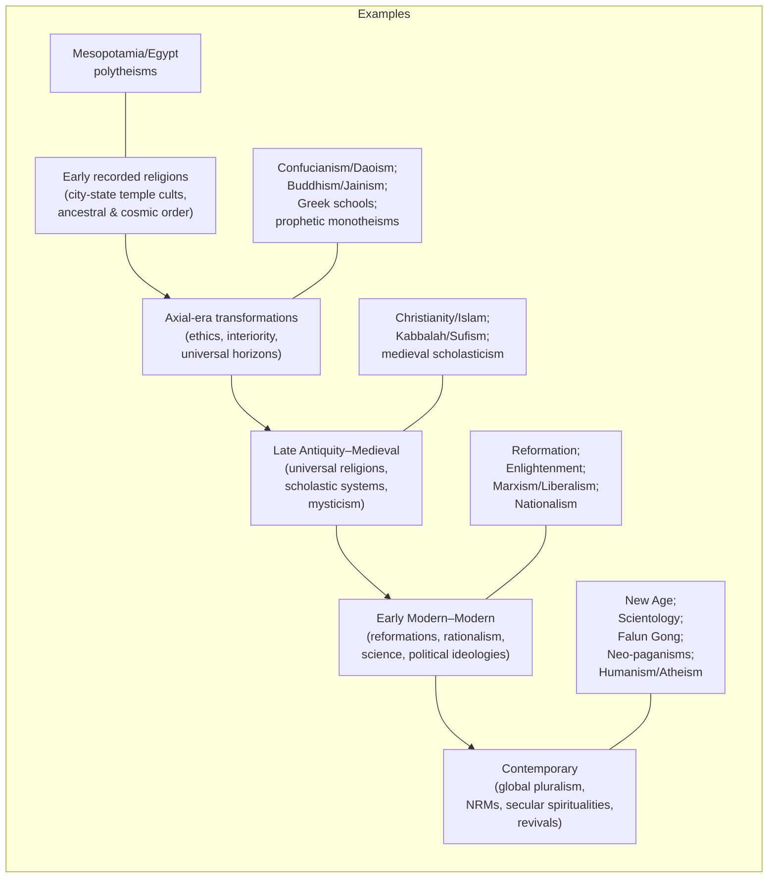
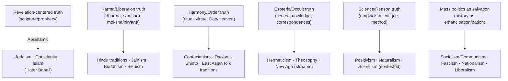

# Truth Taxonomy of Civilizational Belief Systems

## Executive Summary

Human civilizations have repeatedly organized “truth” around a small set of recurring **epistemic authorities** (what counts as reliable knowledge) and **teleological narratives** (what history *is for*). Across religions, philosophies, and ideologies, most systems cluster around a handful of stable patterns: **revelation** (scripture/prophecy), **lineage and ritual** (ancestral/cosmic order enacted in practice), **reasoned inquiry** (philosophical argument), **inner experience** (mystical/meditative insight), **empirical science** (testable models), and **pragmatic success** (truth as what “works” in inquiry or life). citeturn22search13turn22search1turn23search3

A useful civilizational lens is the contested idea of an **“Axial Age”**—a first-millennium BCE turning toward more universal, reflective, and transcendent frameworks, often associated with major long-lived moral and metaphysical revolutions across Eurasia. The term is associated with entity["people","Karl Jaspers","existentialist philosopher"] and remains debated in scholarship, but it highlights a recognizable historical shift: broader moral universalism, interiority, and “ultimate” horizons beyond local cult and state ritual. citeturn35search0turn35search2turn35search5

This report defines a **Truth Taxonomy** as a high-level classification plus a structured catalog of traditions that have significantly shaped civilizations from earliest recorded time to present. Each taxonomy entry is rendered in the requested YAML-like format with four analytic one-liners: a **core motto**, a **common critical argument**, an **ideal end-society**, and a **moral polarity model** of “good vs evil.” Mottos and critiques are **analytic compressions** (not self-adopted slogans), grounded in canonical/official sources and standard academic overviews. citeturn0search0turn13search3turn20search0

Because “all religions and belief systems” is not a finite, universally agreed set (especially for indigenous and local traditions), this taxonomy aims to be **civilizationally comprehensive**: it includes the largest world religions, major historical religions, influential philosophical schools, globally consequential modern ideologies, and widely documented modern/new religious movements, while representing indigenous systems by **major regional complexes and diaspora continuities**, not by attempting an impossible enumeration of every people-specific tradition. citeturn0search0turn7search2turn8search0

## Scope and Method

A “truth taxonomy” must separate (a) **what a system claims is true** (metaphysics), (b) **how it claims to know** (epistemology/authority), (c) **what the human problem is** (sin, suffering, ignorance, oppression, disorder), and (d) **what the end-state is** (salvation, liberation, harmony, justice, progress). Philosophical reference works treat “truth” itself as a long-running, multi-theory problem; this report therefore classifies traditions primarily by their *truth-authority patterns* rather than pretending there is one cross-tradition definition of truth. citeturn22search13turn23search3turn22search1

**Primary/official and canonical corpora** were prioritized where feasible via reputable public-access libraries and official institutional hosts, complemented by academic overview references. Examples of canonical access points used here include: entity["book","The Holy Bible","vatican english index"] via the entity["organization","Vatican","holy see"]’s scripture archive, entity["book","Torah","sefaria english editions"] via entity["organization","Sefaria","online jewish library"], the entity["book","Analects","confucian text james legge trans"] via the entity["organization","Chinese Text Project","classical chinese text database"], and Qur’anic translation infrastructure and Qur’an-service claims as published by the entity["organization","King Fahd Glorious Qur'an Printing Complex","al-madinah, saudi arabia"]. citeturn24search6turn24search9turn24search3turn33search3turn25search1

For broad coverage, this report relies heavily on high-quality synthesis sources: entity["organization","Encyclopaedia Britannica","reference encyclopedia"] for religion/history/ideologies and the entity["organization","Stanford Encyclopedia of Philosophy","academic reference work"] (plus IEP where helpful) for philosophical schools and truth/epistemology frameworks. citeturn0search0turn20search0turn13search3

**Branch handling rule (inheritance):** Many sub-branches share the parent system’s motto/critique/goal/moral polarity. Where a sub-branch differs mainly by *specific doctrines, authority structures, or practices*, it is listed with only the **differentiating items** using `🔎`. This prevents redundant repetition while still showing what *actually* changes across branches. citeturn3search2turn4search0turn18search10

## Timeline and Relationship Map

The timeline below is deliberately coarse: it emphasizes **civilizational inflection points** (city-state cults → axial moral universalization → late-antique universal religions → modern secular ideologies and NRMs). citeturn35search0turn6search0turn20search2

citeturn6search0turn10search12turn35search0turn20search3turn11search3

citeturn20search0turn22search2turn43search7turn12search4turn23search3turn21search1

image_group{"layout":"carousel","aspect_ratio":"16:9","query":["world religions timeline diagram","Axial Age map civilization centers","abrahamic religions family tree diagram","dharmic religions wheel diagram"],"num_per_query":1}

## Taxonomy Entries

- **Mesopotamian religion**: "Maintain cosmic order through correct ritual to the gods." 🧭: "Mythic pantheons can look like political projection of city-state power." 🪓: "A stable polis under divine favor secured by temple rites." 🏛️: "Good: pious kings/priests; Evil: chaos and taboo-breaking; enacted via ritual order vs sacrilege." ⚖️ citeturn6search0  
- **Ancient Egyptian religion**: "Live in harmony with maat; secure a flourishing afterlife." 🧭: "Elaborate mortuary and priestly systems can appear elite-controlled and unfalsifiable." 🪓: "A rightly ordered kingdom mirroring cosmic balance and continuity." 🏛️: "Good: maat-aligned agents (rightful ruler); Evil: isfet/chaos; enacted via justice/rites vs disorder." ⚖️ citeturn6search1  
- **Syro-Palestinian/Canaanite religion**: "Honor the divine powers of fertility, storm, and kingship." 🧭: "Fragmentary evidence and regional variation undermine claims of doctrinal coherence." 🪓: "Agrarian prosperity and political legitimacy under patron deities." 🏛️: "Good: divine patrons and loyal worshipers; Evil: drought/defeat as divine withdrawal; enacted via cult and offering." ⚖️ citeturn40search4turn40search0turn40search8  
- **Ancient Greek religion**: "Reciprocate with the gods to sustain civic and cosmic order." 🧭: "Polytheistic myths can be read as at odds with philosophical ethics and naturalism." 🪓: "A polis whose festivals, oracles, and sacrifices stabilize communal life." 🏛️: "Good: gods/heroes and civic virtue; Evil: hubris and pollution; enacted via piety and moderation vs transgression." ⚖️ citeturn6search2  
- **Roman religion**: "Perform pietas and civic rites to keep pax deorum." 🧭: "State cult can be criticized as instrumental legitimacy rather than spiritual truth." 🪓: "A disciplined, ritually maintained imperium protected by divine favor." 🏛️: "Good: pietas and lawful authority; Evil: impiety and omen-ignored disorder; enacted via public religion vs neglect." ⚖️ citeturn6search3  
- **Celtic religion**: "Bind tribe, land, and gods through rite, oath, and sacred place." 🧭: "Sparse sources make reconstruction uncertain and vulnerable to romanticization." 🪓: "A sacral society ordered by seasonal rites and guardianship of land." 🏛️: "Good: oath-keepers and right ritual; Evil: taboo-breaking and curse; enacted via sacred law vs violation." ⚖️ citeturn7search1  
- **Norse religion**: "Win honor through courage, oath, and right relation to the gods." 🧭: "Heroic fatalism can be criticized as sanctifying violence and hierarchy." 🪓: "A warrior–kin society where honor and reciprocal obligation sustain order." 🏛️: "Good: oath-bound gods/kin; Evil: betrayal and chaos; enacted via courage and gift-exchange vs treachery." ⚖️ citeturn7search0  
- **Slavic religion**: "Align clan and land with the powers of storm, fire, and fertility." 🧭: "Scholarly reconstructions risk over-systematizing sparse, diverse local cults." 🪓: "A community protected by right seasonal rites and household cult." 🏛️: "Good: order-keeping deities and proper rite; Evil: disorder and oath-breaking; enacted via ritual and taboo." ⚖️ citeturn40search5turn40search1  
- **Zoroastrianism**: "Choose truth (asha) against the lie in a cosmic moral struggle." 🧭: "Strict moral dualism can be challenged as metaphysically unstable (two ultimates)." 🪓: "A world renewed by right worship and ethical action toward final renovation." 🏛️: "Good: Ahura Mazda and truth-followers; Evil: destructive spirit/lie; enacted via good thoughts/words/deeds vs deception." ⚖️ citeturn5search2  
- **Gnosticism**: "Awaken through saving knowledge from a flawed or hostile cosmos." 🧭: "Elitist ‘secret knowledge’ is criticized as historically speculative and socially escapist." 🪓: "A liberated spiritual elect free from oppressive cosmic rulers." 🏛️: "Good: hidden divine spark/gnosis; Evil: ignorant rulers/demiurgic powers; enacted via awakening vs bondage." ⚖️ citeturn14search2turn14search6  
- **Manichaeism**: "Liberate light from matter in an uncompromising good–evil dualism." 🧭: "Radical dualism is criticized as self-contradictory and ethically world-denying." 🪓: "A purified community aiding cosmic separation of light and darkness." 🏛️: "Good: Light principle/elect; Evil: Darkness principle; enacted via ascetic discipline vs material entanglement." ⚖️ citeturn14search3turn14search7  
- **Hermeticism (Hermetic writings tradition)**: "Know the divine cosmos through inner illumination and correspondences." 🧭: "Esoteric correspondences are criticized as unfalsifiable and prone to syncretic overreach." 🪓: "A society of initiated knowers harmonizing self and cosmos." 🏛️: "Good: enlightened mind aligned with the All; Evil: ignorance and spiritual sleep; enacted via gnosis vs delusion." ⚖️ citeturn15search1turn15search5  

- **Judaism**: "Live the covenant with the one God through law, worship, and ethics." 🧭: "Divine-law authority is criticized as tradition-bound and hard to verify externally." 🪓: "A just community under Torah and rabbinic practice, oriented to messianic peace." 🏛️: "Good: covenant-faithful; Evil: idolatry and wrongdoing; enacted via mitzvot vs transgression." ⚖️ citeturn42search6turn24search9turn42search8  
  - Orthodox Judaism 🔎: "Distinctives: Torah (Written) and Oral Law as binding norms; strong continuity with traditional halakhah." citeturn42search0turn42search4  
  - Conservative Judaism 🔎: "Distinctives: generally tradition-affirming with explicit modern adjustments in practice and authority." citeturn42search2turn42search9  
  - Reform Judaism 🔎: "Distinctives: many ritual laws treated as non-binding to adapt to modern conditions; ethical monotheism emphasized." citeturn42search1turn42search5  
  - Kabbalah 🔎: "Distinctives: esoteric mysticism of divine emanations (sefirot) and symbolic cosmology." citeturn15search2turn15search6  

- **Christianity**: "Follow Jesus in faith and love to enter God’s redeeming life." 🧭: "Revelation claims face the problem of evil and disputes over authority/interpretation." 🪓: "A reconciled community (‘Kingdom of God’) of justice, mercy, and worship." 🏛️: "Good: God/saints; Evil: sin and Satan; enacted via grace-shaped love vs temptation and injustice." ⚖️ citeturn3search0turn14search18  
  - Roman Catholicism 🔎: "Distinctives: papal and magisterial authority; sacramental system; global hierarchical church structure." citeturn3search1  
  - Eastern Orthodoxy 🔎: "Distinctives: conciliar authority; strong liturgical tradition; emphasis on theosis and icons." citeturn3search3  
  - Protestantism 🔎: "Distinctives: Reformation-era re-centering on scripture and reformation of church authority; diverse denominations." citeturn3search2turn39search10  
    - Evangelicalism 🔎: "Distinctives: preaching, personal conversion, scripture as sole basis for faith, active evangelism." citeturn39search2turn39search6  
    - Pentecostalism 🔎: "Distinctives: gifts of the Spirit (notably tongues) and Spirit-baptism emphasis." citeturn39search1turn39search5  
  - Christian Science 🔎: "Distinctives: mind-healing/metaphysical reading of illness and religious life, founded as a denomination by Mary Baker Eddy." citeturn39search0turn39search8turn39search4  
  - Liberation theology 🔎: "Distinctives: structural sin and political-economic liberation for the poor as a central theological focus." citeturn39search3  

- **Islam**: "Submit to the one God and live justly by revealed guidance." 🧭: "Scriptural-legal authority can be criticized as hard to reconcile with pluralism and reform." 🪓: "A just ummah under divine law and mercy, culminating in final judgment." 🏛️: "Good: God-fearing believers; Evil: shirk and injustice; enacted via worship/charity and law vs corruption and oppression." ⚖️ citeturn2search0turn33search3  
  - Sunni Islam 🔎: "Distinctives: authority centered in prophetic example and community scholarship; varied legal schools." citeturn4search0  
  - Shia Islam 🔎: "Distinctives: imamate-centered authority and sacred lineage claims; distinct jurisprudence/theology." citeturn4search1  
  - Sufism 🔎: "Distinctives: mystical discipline (e.g., dhikr) and interior purification within Islamic monotheism." citeturn4search2turn15search7  
  - Ahmadiyya 🔎: "Distinctives: modern revivalist movement founded by Mirza Ghulam Ahmad; highly contested status within broader Islam." citeturn42search3  
  - Druze faith 🔎: "Distinctives: offshoot of Ismaʿili contexts; esoteric doctrines and community boundaries." citeturn19search0  

- **Bahá’í Faith**: "Humanity is one; revelation is progressive; build unity in diversity." 🧭: "Progressive revelation is criticized as unfalsifiable and smoothing over deep doctrinal contradictions." 🪓: "A globally unified, peaceful civilization with spiritual-moral development." 🏛️: "Good: unity-building and justice; Evil: prejudice and disunity; enacted via consultation and service vs division." ⚖️ citeturn0search3turn5search3  
- **Samaritan religion**: "Keep the true Torah and worship at the chosen sacred mountain." 🧭: "Text and site primacy is criticized as sectarian boundary-making tied to ancient disputes." 🪓: "A covenant community ordered by Torah practice and sacred geography." 🏛️: "Good: covenant fidelity; Evil: deviation from true sanctuary/law; enacted via ritual and purity vs error." ⚖️ citeturn19search2turn19search6  
- **Mandaeism**: "Purify and gain life through ritual knowledge and repeated baptism." 🧭: "Exclusive mythic cosmology is criticized as hard to historicize and socially isolating." 🪓: "A ritually pure community oriented to salvation through gnosis and baptismal practice." 🏛️: "Good: light-world and initiates; Evil: darkness/falsehood powers; enacted via rites vs contamination." ⚖️ citeturn19search3  
- **Yazidism**: "Honor the supreme creator and the Peacock Angel’s stewardship." 🧭: "Outsider misreadings and secrecy fuel controversy and persistent misunderstanding." 🪓: "A bound community sustaining sacred tradition under divine guardianship." 🏛️: "Good: divine guardians and faithful community; Evil: misattribution/hostility and betrayal; enacted via tradition vs persecution." ⚖️ citeturn19search5  

- **Hinduism**: "Follow dharma to transform karma and realize liberation." 🧭: "Plurality of texts and practices is criticized as internally inconsistent and socially hierarchical." 🪓: "A society ordered by dharma—ethical, ritual, and social duties—aimed at moksha for seekers." 🏛️: "Good: dharma-aligned conduct; Evil: adharma/ignorance; enacted via duty, devotion, and insight vs disorder." ⚖️ citeturn2search2turn16search4turn16search8  
  - Vedanta 🔎: "Distinctives: Upanishadic ‘end of the Vedas’ metaphysics; moksha via knowledge/realization of ultimate reality." citeturn16search0turn16search12  
    - Advaita Vedanta 🔎: "Distinctives: nondualism (ultimate reality not truly divided); liberation via realization beyond apparent multiplicity." citeturn16search12turn16search8  
  - Samkhya 🔎: "Distinctives: dualism of purusha and prakriti; liberation via discriminative knowledge." citeturn17search3turn16search1  
  - Yoga (classical) 🔎: "Distinctives: disciplined practice (yoga-sutras) aiming at samadhi and liberation." citeturn38search2turn17search8  
  - Mimamsa 🔎: "Distinctives: Vedic ritual interpretation and justification; dharma via correct action and injunction." citeturn17search1  
  - Vaisheshika 🔎: "Distinctives: realist categories and atomism; moral order includes merit/demerit and (in some views) divine motion." citeturn17search2  
  - Bhakti revival movements 🔎: "Distinctives: devotional concentration (e.g., Krishna devotion) as primary path for many communities." citeturn38search1turn38search6  
  - Brahmo Samaj 🔎: "Distinctives: modern theistic reform; rejects Vedic authority and many traditional doctrines/practices to adapt to modernity." citeturn37search1  
  - Arya Samaj 🔎: "Distinctives: reform aiming to reestablish the Vedas as revealed truth; anti-idolatry and social reform." citeturn37search2turn37search13  
  - Ramakrishna Mission 🔎: "Distinctives: modern Advaita-influenced universalism; strong social service and global outreach." citeturn37search3turn37search14  
  - Hare Krishna / ISKCON 🔎: "Distinctives: modern Vaishnava devotional movement founded as an international organization; central practice includes mantra chanting." citeturn37search0turn38search1  

- **Jainism**: "Do no harm; purify karma through vows and ascetic discipline." 🧭: "Extreme ascetic ideals are criticized as impractical and socially elite." 🪓: "A nonviolent society maximizing spiritual and bodily non-harm." 🏛️: "Good: liberated exemplars and vow-keepers; Evil: karmic bondage via harm and attachment; enacted via vows vs injury." ⚖️ citeturn5search0turn18search4  
  - Digambara 🔎: "Distinctives: stricter ascetic renunciation (e.g., nude male ascetics) and sectarian monastic rules." citeturn18search0  
  - Shvetambara 🔎: "Distinctives: white-robed monasticism; different ascetic rules and community structure." citeturn18search8  

- **Buddhism**: "End suffering by awakening through the Four Noble Truths." 🧭: "No enduring self and no creator-God can be criticized as metaphysically thin or psychologically demanding." 🪓: "A compassionate society shaped by the sangha, ethics, and insight, oriented to nirvana." 🏛️: "Good: wisdom/compassion; Evil: greed, hatred, delusion; enacted via practice vs craving and ignorance." ⚖️ citeturn2search3turn10search12  
  - Theravada 🔎: "Distinctives: strong emphasis on early canon and arhat ideal; monastic discipline central." citeturn10search8turn0search2  
  - Mahayana 🔎: "Distinctives: bodhisattva ideal and expanded sutra traditions; universal liberation emphasis." citeturn4search3turn10search8  
    - Pure Land Buddhism 🔎: "Distinctives: salvation framed through Amitabha devotion and ‘other-power’ trust expressed in name-recitation." citeturn18search2turn18search10  
    - Zen (Chan/Seon/Thiền) 🔎: "Distinctives: direct awakening through disciplined meditation under a teacher; koan practice in some lineages." citeturn18search5turn18search1  
    - Nichiren Buddhism 🔎: "Distinctives: Lotus Sutra supremacy and chanting devotion; historically polemical reform posture in Japan." citeturn18search3turn18search19  
  - Vajrayana (Tantric/Esoteric) 🔎: "Distinctives: mantra, mudra, mandala and deity-identification as accelerators toward awakening." citeturn10search16turn36search7  
    - Shingon 🔎: "Distinctives: Japanese esoteric lineage aiming at Buddha-wisdom not fully expressible in words." citeturn36search3  

- **Sikhism**: "Remember the one God, live honestly, and serve others." 🧭: "Claims of unique revelation and community boundary can be criticized as historically contingent." 🪓: "A truthful, egalitarian community of disciplined service, devotion, and justice." 🏛️: "Good: truthful God-oriented life; Evil: ego and injustice; enacted via remembrance and seva vs oppression." ⚖️ citeturn5search1  

- **Confucianism**: "Cultivate virtue and right ritual to harmonize family and state." 🧭: "Can be criticized for entrenching hierarchy and under-specifying metaphysics." 🪓: "A merit-ethical society led by exemplary persons (junzi) guided by li and ren." 🏛️: "Good: virtue and filial/social responsibility; Evil: selfishness and disorder; enacted via education/ritual vs corruption." ⚖️ citeturn6search?  
  - Canon anchor 🔎: "Core text tradition includes the Analects as a central compilation of teachings." citeturn24search3turn24search7  

- **Daoism (Taoism)**: "Flow with the Dao; act with non-coercive wuwei." 🧭: "Anti-formal language about the Dao can be criticized as too vague to adjudicate." 🪓: "A society of minimal coercion where natural harmony replaces over-governance." 🏛️: "Good: alignment with the Dao; Evil: artificial striving and rigid control; enacted via simplicity vs domination." ⚖️ citeturn43search7turn43search3turn43search11  

- **Mohism**: "Practice impartial care; oppose waste and unjust war." 🧭: "‘Equal care’ is criticized as erasing legitimate partial obligations (family/role) and being socially unrealistic." 🪓: "A frugal, peace-oriented society governed by moral standards and public benefit." 🏛️: "Good: impartial care and civic benefit; Evil: aggressive war and ritual extravagance; enacted via utility vs vanity." ⚖️ citeturn43search4turn43search8  

- **Legalism (Chinese)**: "Order society by law, reward, and punishment—not moral exhortation." 🧭: "Criticized as authoritarian and reducing ethics to coercion and state interest." 🪓: "A strong centralized state producing predictable compliance and stability." 🏛️: "Good: obedience and effective rule; Evil: disorder and faction; enacted via strict institutions vs subversion." ⚖️ citeturn43search5turn43search1  

- **Shinto**: "Maintain purity and honor kami through shrine rite and festivals." 🧭: "Ritual focus can be criticized as offering limited universal ethics or doctrine." 🪓: "A harmonious community sustained by rites, purity, and place-based sacred continuity." 🏛️: "Good: purity/harmony and kami blessing; Evil: pollution and disharmony; enacted via purification and matsuri vs impurity." ⚖️ citeturn43search10turn43search2  
- **Chinese folk religion**: "Sustain family and cosmos through ancestors, local gods, and ritual reciprocity." 🧭: "Criticized as syncretic pragmatism without coherent doctrine, vulnerable to superstition charges." 🪓: "Stable kinship and locality structured by ritual obligations and spirit relations." 🏛️: "Good: filial piety and proper rite; Evil: neglect and spiritual imbalance; enacted via offerings vs abandonment." ⚖️ citeturn6search?  

- **Australian Aboriginal religion (Dreaming)**: "Live the Law of Country through Dreaming stories and songlines." 🧭: "Critics may misread it as ‘myth only’ by applying alien categories of doctrine and scripture." 🪓: "A society sustaining land, kin, and law through ritual, story, and custodianship." 🏛️: "Good: proper custodianship; Evil: law-breaking and land-neglect; enacted via ceremony vs transgression." ⚖️ citeturn8search0  
- **Polynesian religion**: "Respect mana and tapu to maintain sacred power and social order." 🧭: "Sacred status systems can be criticized as legitimating hierarchy and taboo control." 🪓: "A stable island society governed by sacred power relations and ritual constraints." 🏛️: "Good: right use of mana; Evil: tapu violation; enacted via rite and respect vs taboo breach." ⚖️ citeturn8search1  
- **African Traditional Religions (general complex)**: "Live with ancestors and spirits through community rite and moral reciprocity." 🧭: "Criticized as ‘local’ or ‘non-doctrinal’ by outsiders using scriptural criteria." 🪓: "A communal society where kinship, elders, and ritual keep balance with the spirit world." 🏛️: "Good: communal obligation and ancestral favor; Evil: witchcraft/disorder and taboo-breaking; enacted via rite vs harm." ⚖️ citeturn7search2turn10search15  
  - Yoruba religion 🔎: "Distinctives: orisha devotion and detailed ritual cosmology; strong diaspora continuities." citeturn9search1turn9search2turn9search0  
  - Haitian Vodou 🔎: "Distinctives: lwa spirit service and syncretic formation shaped by Atlantic slavery and Catholic contact." citeturn9search0  
  - Santería 🔎: "Distinctives: Afro-Cuban orisha tradition with Catholic-syncretic features." citeturn9search1  
  - Candomblé 🔎: "Distinctives: Afro-Brazilian orixá devotion in Brazilian religious history." citeturn9search2  
  - Rastafarianism 🔎: "Distinctives: modern movement identifying Babylon/Zion moral geography and a liberation narrative." citeturn9search3  

- **Native American religions (regional complex)**: "Keep balance with the powers through ceremony, story, and land relations." 🧭: "Outsider generalization obscures diverse peoples; ‘religion’ category can be a mismatch." 🪓: "A balanced community sustaining reciprocity among humans, spirits, animals, and place." 🏛️: "Good: harmony and right ceremony; Evil: imbalance and disrespect; enacted via ritual reciprocity vs disruption." ⚖️ citeturn7search3  
- **Maya religion**: "Sustain cosmic cycles through rite, kingship, and sacred calendar." 🧭: "Ritualized kingship can be criticized as sacralizing coercion and violence." 🪓: "A cosmos-sustaining society where ritual time anchors political legitimacy." 🏛️: "Good: proper rite and order; Evil: cosmic imbalance; enacted via calendrical ritual vs neglect." ⚖️ citeturn8search2  
- **Aztec religion**: "Feed the sacred powers to keep the sun and cosmos moving." 🧭: "Human sacrifice is a paradigmatic ethical critique and civilizational rupture point." 🪓: "A militarized ritual state sustaining cosmic continuity through tribute and rite." 🏛️: "Good: cosmic maintenance; Evil: darkness/ending; enacted via sacrifice/ritual vs cosmic collapse." ⚖️ citeturn8search3  
- **Inca religion**: "Honor the Sun and state cult to sustain empire and crops." 🧭: "State cult is criticized as political consolidation through sacred ancestry claims." 🪓: "An ordered empire under solar ancestry and imposed worship." 🏛️: "Good: Inti and sanctioned rulers; Evil: disorder and failed reciprocity; enacted via state ritual vs impiety." ⚖️ citeturn40search6turn40search2  

- **Platonism (as a truth-ontology)**: "Truth is anchored in higher, non-physical realities beyond appearances." 🧭: "Abstract-object realism is criticized as ontologically extravagant and causally mysterious." 🪓: "A society led by philosophical insight and education toward the good." 🏛️: "Good: rational ascent to forms; Evil: ignorance and illusion; enacted via dialectic vs appetitive capture." ⚖️ citeturn13search0turn13search4  
- **Aristotelian virtue ethics**: "Flourish through cultivated virtue guided by reason and habit." 🧭: "Virtue accounts face disputes about what counts as ‘flourishing’ across cultures." 🪓: "A polity forming citizens’ character through institutions and education." 🏛️: "Good: practical wisdom and virtue; Evil: vice and uncontrolled passions; enacted via habituation vs corruption." ⚖️ citeturn13search6turn13search2  
- **Stoicism**: "Live according to nature and reason; practice virtue and inner freedom." 🧭: "Can be criticized as emotionally suppressive or overly resigned to injustice." 🪓: "A cosmopolis of rational agents acting virtuously regardless of external fortune." 🏛️: "Good: virtue/reason; Evil: vice/false judgment; enacted via self-mastery vs passion-driven error." ⚖️ citeturn0search1turn14search12  
- **Epicureanism**: "Seek tranquility by limiting desire and removing fear of gods and death." 🧭: "Can be criticized as reducing meaning to pleasure/tranquility and undervaluing duty." 🪓: "A simple friendship-based community minimizing needless pain and anxiety." 🏛️: "Good: clear natural understanding; Evil: superstition and empty desire; enacted via moderation vs craving." ⚖️ citeturn13search1turn13search5  
- **Ancient Skepticism (Pyrrhonism/Academic)**: "Suspend dogma; continue inquiry to reach mental tranquility." 🧭: "Self-refutation critique: universal doubt undermines its own claims and practice." 🪓: "A tolerant society valuing inquiry over ideological certainty." 🏛️: "Good: open investigation; Evil: rash assent/dogmatism; enacted via epoché vs ideological capture." ⚖️ citeturn13search3turn13search11turn13search15  
- **Cynicism (ancient)**: "Be free by living simply in accord with nature against convention." 🧭: "Criticized as socially corrosive and unable to scale to stable institutions." 🪓: "A society stripped of status games, where autonomy and honesty dominate." 🏛️: "Good: self-sufficiency and truthfulness; Evil: convention-fueled corruption; enacted via scandal of simplicity vs hypocrisy." ⚖️ citeturn14search8turn14search0  
- **Neoplatonism**: "Return to the One through contemplation and spiritual ascent." 🧭: "Emanation metaphysics can be criticized as speculative and system-building beyond evidence." 🪓: "A society where spiritual education and contemplation orient life to the highest principle." 🏛️: "Good: ascent to the One; Evil: dispersion into multiplicity; enacted via contemplation vs attachment." ⚖️ citeturn14search5turn14search1  

- **Positivism**: "Confine knowledge to experience and scientific method; reject metaphysics." 🧭: "Criticized as self-undermining if its own criterion is not empirically verifiable." 🪓: "A rationally administered society guided by science and social organization." 🏛️: "Good: scientific comprehension; Evil: metaphysical illusion; enacted via method vs speculation." ⚖️ citeturn22search2turn22search14  
- **Pragmatism (truth)**: "Treat truth as what inquiry would stabilize on or what ‘works’ in practice." 🧭: "Criticized for collapsing truth into usefulness or consensus under power." 🪓: "A society committed to fallibilism, experimentation, and problem-solving institutions." 🏛️: "Good: responsible inquiry; Evil: empty disputes and dogma; enacted via experimentation vs stagnation." ⚖️ citeturn22search1turn22search5  
- **Existentialism**: "Live authentically by owning freedom, choice, and responsibility." 🧭: "Criticized as overly individualistic and weak on shared norms for politics." 🪓: "A society that enables authenticity rather than mass conformity." 🏛️: "Good: authenticity; Evil: bad faith and conformism; enacted via responsible choice vs self-deception." ⚖️ citeturn22search0turn22search4  
- **Humanism (broad)**: "Center human dignity, education, and agency in moral and cultural life." 🧭: "Criticized as anthropocentric and under-anchored metaphysically." 🪓: "A cultivated society educating citizens toward balanced virtue and civic responsibility." 🏛️: "Good: dignity and reasoned virtue; Evil: ignorance and cruelty; enacted via learning and civic art vs barbarism." ⚖️ citeturn23search6turn22search11  
- **Secular humanism**: "Solve human problems through reason and shared values rather than religion." 🧭: "Criticized as smuggling moral commitments without transcendent grounding." 🪓: "A pluralist society with human rights, science, and ethics as common civic basis." 🏛️: "Good: human flourishing and autonomy; Evil: superstition/oppression; enacted via institutions and rights vs coercion." ⚖️ citeturn23search2turn23search10  
- **Atheism**: "Reject belief in gods; rely on natural explanations and human responsibility." 🧭: "Criticized as unable to ground objective meaning/value (a debated philosophical point)." 🪓: "A society organized without religious authority, often emphasizing secular ethics." 🏛️: "Good: intellectual honesty and ethics; Evil: dogma and harm; enacted via critique and responsibility vs credulity." ⚖️ citeturn23search0turn23search4  
- **Agnosticism**: "Withhold claims about what cannot be known beyond experience." 🧭: "Criticized as evasive when practical commitments demand decision under uncertainty." 🪓: "A tolerant society allowing plural answers while limiting dogmatic authority claims." 🏛️: "Good: epistemic humility; Evil: overclaiming certainty; enacted via restraint vs credulity." ⚖️ citeturn23search1turn23search9  
- **Naturalism (ontological)**: "All spatiotemporal reality is physical or physically constituted." 🧭: "Criticized for difficulty accommodating consciousness, normativity, or ‘aboutness’ (ongoing debates)." 🪓: "A society where explanation and policy are guided by scientific worldviews." 🏛️: "Good: causal explanation and coherence; Evil: supernatural error; enacted via science-aligned inquiry vs mystification." ⚖️ citeturn23search3turn23search7  
- **Scientism (as criticized posture)**: "Treat science as the universal arbiter of fundamentals beyond its domain." 🧭: "Criticized for illegitimately extending scientific method to meaning, value, and metaphysics." 🪓: "A technocratic culture privileging scientific authority across institutions." 🏛️: "Good: scientific mastery; Evil: ‘irrationality’; enacted via deference to science vs marginalizing other knowing." ⚖️ citeturn41search2  

- **Liberalism (political)**: "Political power must be publicly justified; respect rights and liberty." 🧭: "Criticized as atomizing, culturally thin, and masking structural inequality." 🪓: "A rights-protecting order with constrained authority and plural life plans." 🏛️: "Good: free and equal citizens; Evil: arbitrary coercion; enacted via rule of law vs domination." ⚖️ citeturn20search0turn20search12  
- **Conservatism (political)**: "Preserve valuable traditions; change gradually with humility about human nature." 🧭: "Criticized as defending unjust status quo and slowing necessary reform." 🪓: "A stable society where inherited institutions constrain risk and moral overreach." 🏛️: "Good: continuity and prudence; Evil: reckless utopianism; enacted via gradualism vs radical rupture." ⚖️ citeturn21search3turn21search7  
- **Democracy (political ideal-type)**: "Legitimacy comes from the people deciding law and leadership." 🧭: "Criticized as vulnerable to tyranny of the majority and manipulation." 🪓: "A polity where citizens share rule directly or through free elections." 🏛️: "Good: participatory citizens; Evil: domination and disenfranchisement; enacted via votes and rights vs coercion." ⚖️ citeturn41search3turn41search15  
- **Nationalism (political)**: "Loyalty to the nation-state outweighs other allegiances." 🧭: "Criticized for exclusion, myth-making, and conflict escalation." 🪓: "A self-determining nation-state unifying identity, territory, and sovereignty." 🏛️: "Good: patriots defending the nation; Evil: enemies/traitors/foreign domination; enacted via mobilization vs disloyalty." ⚖️ citeturn20search3turn20search11  
- **Socialism (political/economic family)**: "Organize production for needs and equality via social ownership and planning/coordination." 🧭: "Criticized as risking inefficiency, coercion, and power concentration." 🪓: "A cooperative society prioritizing equality, community, and needs-satisfaction." 🏛️: "Good: workers/solidarity; Evil: exploitation; enacted via collective control vs class domination." ⚖️ citeturn20search1turn20search5  
- **Communism (political/economic)**: "Abolish class and private property to create a classless society." 🧭: "Criticized via historical governance failures and risks of authoritarian transition." 🪓: "A stateless (in ideal form) classless society with common ownership." 🏛️: "Good: proletarian emancipation; Evil: bourgeois exploitation; enacted via revolution/transition vs class rule." ⚖️ citeturn21search1turn21search17  
- **Anarchism (political)**: "Question authority; pursue freedom from domination through non-coercive community." 🧭: "Criticized as unrealistic regarding security, coordination, and large-scale infrastructure." 🪓: "Stateless voluntary associations built on consensus and equality." 🏛️: "Good: non-dominating community; Evil: coercive hierarchy/state power; enacted via mutual aid vs domination." ⚖️ citeturn21search0  
- **Fascism (political)**: "Subordinate the individual to an ultranational ‘people’s community’ under authoritarian rule." 🧭: "Criticized as inherently violent, anti-democratic, and identity-mystifying." 🪓: "A mobilized totalizing nation-state demanding unity, discipline, and hierarchy." 🏛️: "Good: the nation and its loyalists; Evil: internal ‘degenerates’ and external enemies; enacted via force and myth." ⚖️ citeturn20search2turn20search14  
- **Capitalism (economic ideology as worldview)**: "Private ownership and markets coordinate production and reward innovation." 🧭: "Criticized for inequality, commodification, and externalized social/environmental costs." 🪓: "A market society where exchange and entrepreneurship drive prosperity." 🏛️: "Good: voluntary exchange/enterprise; Evil: coercion and restriction; enacted via markets vs central control." ⚖️ citeturn41search1turn41search5  
- **Environmentalism (ethical-political)**: "Protect nature by changing harmful human activity and social organization." 🧭: "Criticized as anti-development or value-laden beyond science alone." 🪓: "A society whose economy and institutions are compatible with ecological limits." 🏛️: "Good: stewardship and sustainability; Evil: pollution and ecological destruction; enacted via policy and restraint vs exploitation." ⚖️ citeturn41search0  
- **Utilitarianism (ethical)**: "Maximize overall happiness; judge right and wrong by consequences." 🧭: "Criticized for permitting injustice if it increases aggregate welfare." 🪓: "A society optimizing well-being through evidence-based law and policy." 🏛️: "Good: increased happiness; Evil: avoidable suffering; enacted via utility calculus vs taboo rule." ⚖️ citeturn21search2turn21search10  
- **Feminism (as civilizational ideology)**: "Full social, economic, and political equality for women." 🧭: "Criticized (by opponents) as destabilizing tradition or ignoring sex-based difference; defended as justice." 🪓: "A society with equal rights, opportunity, and power access across genders." 🏛️: "Good: equality and autonomy; Evil: patriarchy and discrimination; enacted via rights movements and reform vs exclusion." ⚖️ citeturn40search3turn40search11  

- **Theosophy**: "Recover an ancient wisdom-tradition uniting religions through occult insight." 🧭: "Criticized as historically ungrounded synthesis and authority-by-claim of hidden masters." 🪓: "A spiritually unified humanity guided by esoteric knowledge." 🏛️: "Good: enlightened adepts; Evil: ignorance/materialism; enacted via initiation and study vs spiritual blindness." ⚖️ citeturn12search4turn12search12  
- **Spiritualism (modern)**: "Communicate with the dead as empirical proof of the spirit world." 🧭: "Criticized for fraud susceptibility and weak evidential standards." 🪓: "A society comforted and morally guided by continued personhood after death." 🏛️: "Good: truthful mediums/spirits; Evil: deception; enacted via séances/mediumship vs exploitation." ⚖️ citeturn12search9turn12search1  
- **New Thought**: "Right thinking heals and transforms life through mind–spirit power." 🧭: "Criticized as blaming sufferers and confusing metaphysics with medical causality." 🪓: "A society of self-mastery, health, and prosperity through mental discipline." 🏛️: "Good: correct thought and faith in divine intelligence; Evil: wrong belief; enacted via affirmation vs error." ⚖️ citeturn38search3turn38search7  
- **New Age movement**: "Personal transformation and ‘love/light’ herald a coming new era." 🧭: "Criticized as credulous syncretism and consumer spirituality without accountability." 🪓: "A globally transformed consciousness culture aligning spirituality with healing and self-actualization." 🏛️: "Good: awakened seekers; Evil: ‘negative energy’/oppressive systems; enacted via healing/channeling vs fear." ⚖️ citeturn38search11turn11search3  
- **Wicca (modern pagan witchcraft)**: "Honor nature and the sacred feminine/masculine through ethical ritual." 🧭: "Criticized as invented tradition and lacking historical continuity claims’ evidence." 🪓: "A tolerant nature-revering society practicing ritual without coercion." 🏛️: "Good: balanced nature and ethical magic; Evil: harmful witchcraft/abuse; enacted via harm-none ethic vs coercion." ⚖️ citeturn10search11turn10search15  
- **Scientology (as a modern religious system)**: "Free the thetan through auditing to overcome engrams." 🧭: "Criticized as coercive, commercially entangled, and epistemically closed to falsification." 🪓: "A ‘cleared’ civilization where individuals operate as fully optimized spiritual beings." 🏛️: "Good: cleared individuals; Evil: reactive mind/entrapment; enacted via auditing/discipline vs suppression." ⚖️ citeturn10search14turn10search10  
- **Falun Gong**: "Cultivate moral character and qigong practice for spiritual elevation." 🧭: "Criticized as socially controversial and politically entangled under state conflict." 🪓: "A society of high moral standards and spiritual cultivation." 🏛️: "Good: cultivators of virtue; Evil: moral decline and oppression; enacted via practice vs persecution." ⚖️ citeturn10search9turn10search13  
- **Cao Dai**: "Unify religions under a syncretic divine order with disciplined hierarchy." 🧭: "Criticized as politically instrumental syncretism and authority-by-structure." 🪓: "A morally unified society integrating multiple religious ethics into one order." 🏛️: "Good: unity and moral discipline; Evil: division and colonial/violent turmoil; enacted via organized worship vs faction." ⚖️ citeturn36search0turn36search4  
- **Tenrikyō**: "Live the ‘Joyous Life’ through devotion to the divine parent and service." 🧭: "Criticized as founder-centered revelation and culturally bounded practice." 🪓: "A society oriented to joyous life through charity, ritual, and communal care." 🏛️: "Good: joyous service; Evil: self-centeredness; enacted via practice and community vs miserliness." ⚖️ citeturn36search1turn36search5  
- **Transcendental Meditation**: "Repeat mantra to settle mind and access deeper consciousness." 🧭: "Criticized as commodified spirituality with contested claims of effects and meaning." 🪓: "A calmer society where stress reduction supports social harmony." 🏛️: "Good: coherence/peace; Evil: stress and turbulence; enacted via practice vs distraction." ⚖️ citeturn38search0turn38search8  

## Comparative Tables

These tables compare major sibling branches where doctrinal/authority differences are historically consequential for institutions and society.

| Tradition family | Core authority locus | Typical “human problem” framing | Typical end-goal framing |
|---|---|---|---|
| Abrahamic monotheisms | revelation + scripture + interpretive communities | sin, injustice, idolatry, rebellion | redeemed or just community and final judgment/peace |
| Dharmic/karma-liberation systems | dharma teachings + practice + insight | suffering/ignorance and karmic bondage | liberation from samsara (moksha/nirvana) and compassionate order |
| East Asian harmony/order systems | ritual + virtue + cosmic order (Dao/Heaven/kami) | disorder via misrule, imbalance, impurity | social harmony, right governance, alignment with the Way |
| Modern secular ideologies | political philosophy + social science + moral commitments | oppression/inequality, domination, irrationality | emancipation, rights, prosperity, nation-state unity, or ecological stability |

citeturn42search6turn2search3turn43search7turn20search0turn41search0

| Branch comparison | Main differentiator (high load-bearing) | Institutional/social implication |
|---|---|---|
| Christianity: Catholic / Orthodox / Protestant | locus of authority (papacy vs conciliar tradition vs reformation re-centering on scripture) | governance structure, sacramental systems, plural denominational ecology |
| Islam: Sunni / Shia / Sufi | authority and leadership models (community scholarship vs imamate) and inner-mystical disciplines | jurisprudential schools, communal identity, spiritual orders |
| Buddhism: Theravada / Mahayana / Vajrayana | soteriological ideals and canonical corpora; tantric methods in Vajrayana | monastic vs lay emphases; ritual/meditation toolsets; transregional cultural forms |
| Judaism: Orthodox / Conservative / Reform | binding force of halakhah and modern adaptation | ritual observance levels, authority of tradition, modern integration models |

citeturn3search1turn3search3turn3search2turn4search0turn4search1turn4search2turn10search8turn42search0turn42search2turn42search1

## Source Notes and Caveats

The catalog uses elite reference syntheses for breadth and consistency (especially entity["organization","Encyclopaedia Britannica","reference encyclopedia"]) while grounding key “authority” claims in canonical access points (e.g., entity["organization","Vatican","holy see"] Bible archive, entity["organization","Sefaria","online jewish library"], entity["organization","Chinese Text Project","classical chinese text database"], and the entity["organization","King Fahd Glorious Qur'an Printing Complex","al-madinah, saudi arabia"]). citeturn24search6turn24search9turn24search3turn33search3turn25search1

Indigenous systems are represented by **major complexes** rather than exhaustive tribal listing, because the latter would require thousands of entries and would still be incomplete; this is a limitation of the medium, not of their civilizational importance. citeturn7search2turn8search0turn8search1

Finally, several categories here (e.g., “scientism,” “capitalism,” “democracy”) are better understood as **contested labels** or **ideal-types** rather than single unified traditions; they are included because they function as civilizational truth-claims and shape institutions and moral narratives in the modern world. citeturn41search2turn41search1turn41search3